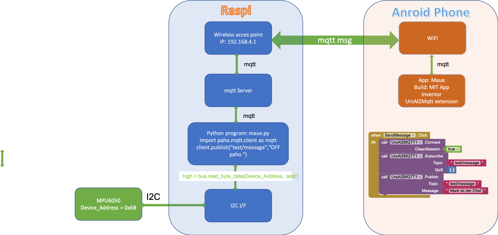
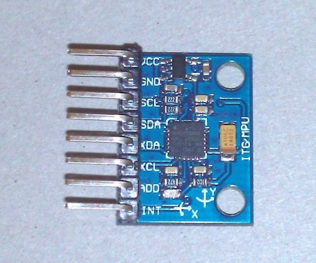
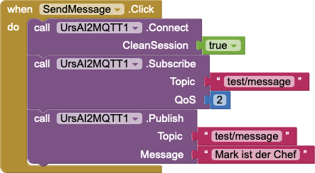
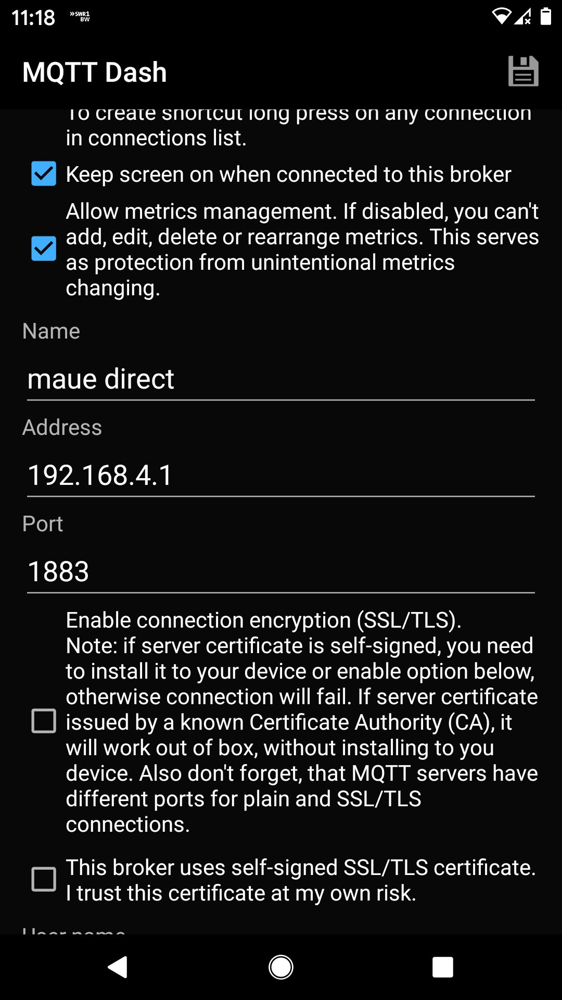
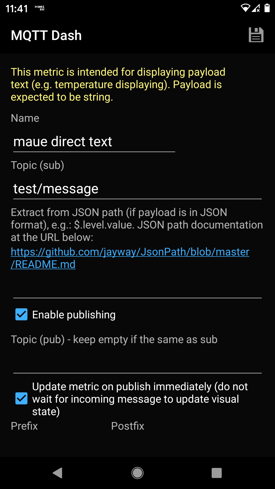

# Develop Android app to park a camper level

In order to place a camper level so that people fall asleep rather than out of bed a system was developed which shows roll and pitch of the camper on an Android phone.

The system consists of three components

- MPU6050
    - I2C I/F
- Raspi
    - mqtt server
    - python program
        - paho to deal with mqtt msg.
    - I2C I/F
- Android phone
    - App
        - Developed with MIT app inventor
        - UrsAI2Mqtt extension


The whole system scheme looks like

---

 
---

The sensor itself is a MEMS and rather small

 


## Setting up a Raspberry Pi as a Wireless Access Point

Setting up the raspi as a wireless access point so that you can use mosquitto on a camping ground follow instructions given at https://www.raspberrypi.org/documentation/configuration/wireless/access-point.md   
This documentation assumes that we are using the standard 192.168.x.x IP addresses for our wireless network, so we will assign the server the 

- IP address 192.168.4.1 

**Note:** Change default in `sudo nano /etc/hostapd/hostapd.conf` to something meaningful to you

```
ssid=NameOfNetwork # change this
hw_mode=g
channel=7
wmm_enabled=0
macaddr_acl=0
auth_algs=1
ignore_broadcast_ssid=0
wpa=2
wpa_passphrase=AardvarkBadgerHedgehog # change this
```

## Build an MQTT Server Using Raspberry Pi

To exchange messages between raspi and phone we use mqtt messages, therefore we **install a mqtt server on the raspi** following the instructions given in the blog [Introduction to IoT: Build an MQTT Server Using Raspberry Pi](https://appcodelabs.com/introduction-to-iot-build-an-mqtt-server-using-raspberry-pi)

we can then subscribe to a topic with

`mosquitto_sub -h localhost -t "test/message"`

in our case the localhost IP is 192.168.4.1 so the command is

`mosquitto_sub -h 192.168.4.1 -t "test/message"`

Once open, publish message to the test/message topic like this:
`mosquitto_pub -h 192.168.4.1 -t "test/message" -m "Hello, world"` 


### To test with Mac 
To run a quick test you can 
Install a mosquitto client 
```
brew update
brew install mosquitto
```


## paho: use mqtt with Python

This code provides a client class which enable applications to connect to an MQTT broker to publish messages, and to subscribe to topics and receive published messages. It also provides some helper functions to make publishing one off messages to an MQTT server very straightforward.

https://pypi.org/project/paho-mqtt/

```python

import paho.mqtt.client as mqtt

# The callback for when the client receives a CONNACK response from the server.
def on_connect(client, userdata, flags, rc):
    print("Connected with result code "+str(rc))

    # Subscribing in on_connect() means that if we lose the connection and
    # reconnect then subscriptions will be renewed.
    client.subscribe("$SYS/#")

# The callback for when a PUBLISH message is received from the server.
def on_message(client, userdata, msg):
    print(msg.topic+" "+str(msg.payload))

client = mqtt.Client()
client.on_connect = on_connect
client.on_message = on_message

client.connect("192.168.4.1", 1883, 60)

client.publish("test/message","OFF paho ")#publish

# Blocking call that processes network traffic, dispatches callbacks and
# handles reconnecting.
# Other loop*() functions are available that give a threaded interface and a
# manual interface.
client.loop_forever()


```


## App development with MIT APP Inventor

[MIT App Inventor is an intuitive, visual programming environment that allows everyone – even children – to build fully functional apps for smartphones and tablets.](https://appinventor.mit.edu/about-us). 

Using the extension UrsAI2Mqtt from [AI2 MQTT Extension: Messwerte hin und her](http://bienonline.magix.net/public/android-AI2-MQTT-de.html) the usage of mqtt message is very easy. The logic block can be seen below.


 


## Measuring Rotation and acceleration with the Raspberry Pi

Follow instructions at **MPU6050 (Accelerometer+Gyroscope) Interfacing with Raspberry Pi** https://www.electronicwings.com/raspberry-pi/mpu6050-accelerometergyroscope-interfacing-with-raspberry-pi

## Calculate pitch and roll

from `MPU6050_9Axis_MotionApps41.h`

```python

uint8_t MPU6050::dmpGetYawPitchRoll(float *data, Quaternion *q, VectorFloat *gravity) {
    // yaw: (about Z axis)
    data[0] = atan2(2*q -> x*q -> y - 2*q -> w*q -> z, 2*q -> w*q -> w + 2*q -> x*q -> x - 1);
    // pitch: (nose up/down, about Y axis)
    data[1] = atan(gravity -> x / sqrt(gravity -> y*gravity -> y + gravity -> z*gravity -> z));
    // roll: (tilt left/right, about X axis)
    data[2] = atan(gravity -> y / sqrt(gravity -> x*gravity -> x + gravity -> z*gravity -> z));
    return 0;
```

or

```python
#Roll and Pitch (self made)
    roll = math.atan(acc_y /  math.sqrt(acc_x*acc_x + acc_z*acc_z))
    # pitch: (nose up/down, about Y axis)
    pitch = math.atan(acc_x / math.sqrt(acc_y*acc_y + acc_z*acc_z))

    roll_deg = roll * (180.0/math.pi)
    pitch_deg = pitch * (180.0/math.pi)
```


### Python script to read MPU6050

```python
'''
        Read Gyro and Accelerometer by Interfacing Raspberry Pi with MPU6050 using Python
    http://www.electronicwings.com
'''
import smbus            #import SMBus module of I2C
from time import sleep          #import
import math

#some MPU6050 Registers and their Address
PWR_MGMT_1   = 0x6B
SMPLRT_DIV   = 0x19
CONFIG       = 0x1A
GYRO_CONFIG  = 0x1B
INT_ENABLE   = 0x38
ACCEL_XOUT_H = 0x3B
ACCEL_YOUT_H = 0x3D
ACCEL_ZOUT_H = 0x3F
GYRO_XOUT_H  = 0x43
GYRO_YOUT_H  = 0x45
GYRO_ZOUT_H  = 0x47


def MPU_Init():
    #write to sample rate register
    bus.write_byte_data(Device_Address, SMPLRT_DIV, 7)
    
    #Write to power management register
    bus.write_byte_data(Device_Address, PWR_MGMT_1, 1)
    
    #Write to Configuration register
    bus.write_byte_data(Device_Address, CONFIG, 0)
    
    #Write to Gyro configuration register
    bus.write_byte_data(Device_Address, GYRO_CONFIG, 24)
    
    #Write to interrupt enable register
    bus.write_byte_data(Device_Address, INT_ENABLE, 1)

def read_raw_data(addr):
    #Accelero and Gyro value are 16-bit
        high = bus.read_byte_data(Device_Address, addr)
        low = bus.read_byte_data(Device_Address, addr+1)
    
        #concatenate higher and lower value
        value = ((high << 8) | low)
        
        #to get signed value from mpu6050
        if(value > 32768):
                value = value - 65536
        return value


bus = smbus.SMBus(1)    # or bus = smbus.SMBus(0) for older version boards
Device_Address = 0x68   # MPU6050 device address

MPU_Init()

print (" Reading Data of Gyroscope and Accelerometer")

while True:
    
    #Read Accelerometer raw value
    acc_x = read_raw_data(ACCEL_XOUT_H)
    acc_y = read_raw_data(ACCEL_YOUT_H)
    acc_z = read_raw_data(ACCEL_ZOUT_H)
    
    #Read Gyroscope raw value
    gyro_x = read_raw_data(GYRO_XOUT_H)
    gyro_y = read_raw_data(GYRO_YOUT_H)
    gyro_z = read_raw_data(GYRO_ZOUT_H)
    
    #Full scale range +/- 250 degree/C as per sensitivity scale factor
    Ax = acc_x/16384.0
    Ay = acc_y/16384.0
    Az = acc_z/16384.0
    
    Gx = gyro_x/131.0*180/math.pi
    Gy = gyro_y/131.0*180/math.pi
    Gz = gyro_z/131.0*180/math.pi
    

    print ("Gx=%.2f" %Gx, u'\u00b0'+ "/s", "\tGy=%.2f" %Gy, u'\u00b0'+ "/s", "\tGz=%.2f" %Gz, u'\u00b0'+ "/s", "\tAx=%.2f g" %Ax, "\tAy=%.2f g" %Ay, "\tAz=%.2f g" %Az)     
    sleep(1)
```

gives the following output

```bash

 Reading Data of Gyroscope and Accelerometer
('Gx=-2.62', u'\xb0/s', '\tGy=11.37', u'\xb0/s', '\tGz=-7.87', u'\xb0/s', '\tAx=-0.93 g', '\tAy=-0.01 g', '\tAz=0.20 g')
('Gx=-15.75', u'\xb0/s', '\tGy=4.37', u'\xb0/s', '\tGz=-7.87', u'\xb0/s', '\tAx=-0.94 g', '\tAy=-0.01 g', '\tAz=0.19 g')
('Gx=-22.74', u'\xb0/s', '\tGy=5.25', u'\xb0/s', '\tGz=-6.56', u'\xb0/s', '\tAx=-0.93 g', '\tAy=-0.03 g', '\tAz=0.19 g')
('Gx=-19.68', u'\xb0/s', '\tGy=6.56', u'\xb0/s', '\tGz=-6.56', u'\xb0/s', '\tAx=-0.93 g', '\tAy=-0.00 g', '\tAz=0.20 g')
('Gx=-19.24', u'\xb0/s', '\tGy=3.94', u'\xb0/s', '\tGz=-7.44', u'\xb0/s', '\tAx=-0.94 g', '\tAy=-0.01 g', '\tAz=0.20 g')

```

# Stuff not used but at the end...


## Handle mqtt messages on phone

Using the android app [**MQTT Dash (IoT, Smart Home)**](https://play.google.com/store/apps/details?id=net.routix.mqttdash&hl=en)

To connect to the mosquitto server on the raspi open the app and press "+" no the top right corner, you get a menu were you add the following info


 

Once the connection is set up you can define tiles which subscribe certain topics, in this case  

- name of the tile: maue direct text  
- topic (sub): tests/message  

 


An example on how the tiles look is given below

 


is created by (but does't run on my raspi)   
[Measuring Rotation and acceleration with the Raspberry Pi](http://www.raspberrypirobotics.com/measuring-rotation-and-acceleration-with-the-raspberry-pi/)  

```python

#!/usr/bin/python
import smbus
import math
 
# Register
power_mgmt_1 = 0x6b
power_mgmt_2 = 0x6c
 
def read_byte(reg):
    return bus.read_byte_data(address, reg)
 
def read_word(reg):
    h = bus.read_byte_data(address, reg)
    l = bus.read_byte_data(address, reg+1)
    value = (h << 8) + l return value def read_word_2c(reg): val = read_word(reg) if (val >= 0x8000):
        return -((65535 - val) + 1)
    else:
        return val
 
def dist(a,b):
    return math.sqrt((a*a)+(b*b))
 
def get_y_rotation(x,y,z):
    radians = math.atan2(x, dist(y,z))
    return -math.degrees(radians)
 
def get_x_rotation(x,y,z):
    radians = math.atan2(y, dist(x,z))
    return math.degrees(radians)
 
bus = smbus.SMBus(1) # bus = smbus.SMBus(0) fuer Revision 1
address = 0x68       # via i2cdetect
 
# Aktivieren, um das Modul ansprechen zu koennen
bus.write_byte_data(address, power_mgmt_1, 0)
 
print "Gyroscope Sensor"
print "--------"
 
gyroscope_xout = read_word_2c(0x43)
gyroscope_yout = read_word_2c(0x45)
gyroscope_zout = read_word_2c(0x47)
 
print "gyroscope_xout: ", ("%5d" % gyroscope_xout), " scaled: ", (gyroscope_xout / 131)
print "gyroscope_yout: ", ("%5d" % gyroscope_yout), " scaled: ", (gyroscope_yout / 131)
print "gyroscope_zout: ", ("%5d" % gyroscope_zout), " scaled: ", (gyroscope_zout / 131)
 
print
print "Accelerometer Sensor"
print "---------------------"
 
acceleration_xout = read_word_2c(0x3b)
acceleration_yout = read_word_2c(0x3d)
acceleration_zout = read_word_2c(0x3f)
 
acceleration_xout_scaled = acceleration_xout / 16384.0
acceleration_yout_scaled = acceleration_yout / 16384.0
acceleration_zout_scaled = acceleration_zout / 16384.0
 
print "acceleration_xout: ", ("%6d" % acceleration_xout), " scaled: ", acceleration_xout_scaled
print "acceleration_yout: ", ("%6d" % acceleration_yout), " scaled: ", acceleration_yout_scaled
print "acceleration_zout: ", ("%6d" % acceleration_zout), " scaled: ", acceleration_zout_scaled
 
print "X Rotation: " , get_x_rotation(acceleration_xout_scaled, acceleration_yout_scaled, acceleration_zout_scaled)
print "Y Rotation: " , get_y_rotation(acceleration_xout_scaled, acceleration_yout_scaled, acceleration_zout_scaled)
```


